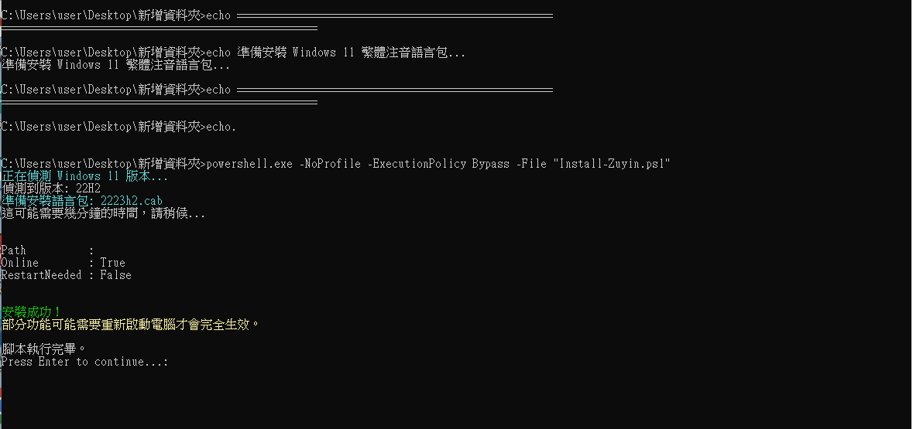

# Windows 11 繁體注音離線安裝工具

本專案提供一個用於 Windows 11 離線環境的語言功能包（繁體注音）自動化安裝腳本。專為無法連接至 Windows Update 的企業內網環境或離線系統設計。

腳本會自動識別目前的 Windows 11 系統版本（22H2/23H2 或 24H2/25H2），並呼叫系統內建的 DISM 工具安裝對應的 CAB 封裝檔。

## 功能特點

1. 自動要求管理員權限：透過啟動器自動觸發 UAC 授權。
2. 自動繞過執行原則：無需手動修改系統的 PowerShell ExecutionPolicy。
3. 版本智慧偵測：自動判斷 OS 版本並選擇正確的安裝包。
4. 完全離線執行：不需連網，適合封閉式環境部署。

## 檔案結構

在使用本工具前，請確保資料夾中包含以下檔案。請注意，本專案包含微軟官方的 CAB 檔案，需請使用者自行準備。來源取自
https://learn.microsoft.com/en-us/azure/virtual-desktop/windows-11-language-packs


```text
Win11-Zuyin-Installer/
├── Install.bat                  (一鍵啟動器，使用者執行此檔)
├── Install-Zuyin.ps1            (PowerShell 安裝核心邏輯)
├── README.md                    (本說明文件)
├── 22H2/23H2 TW專用語言包
└── 24H2/25H2 TW專用語言包
```


## 使用說明

1. 將整個專案資料夾部署至目標電腦。
2. 以滑鼠左鍵連按兩下 Install.bat 檔案。
3. 當系統彈出「使用者帳戶控制」視窗時，點選「是」。
4. 腳本將啟動 PowerShell 視窗並開始安裝。
5. 安裝完成後，視窗會顯示結果，按任意鍵即可結束。
6. 安裝完成後建議重新啟動電腦，以確保輸入法功能完全生效。



## 常見問題與排除

 

## 授權說明
本專案採用 MIT 授權條款開放使用。